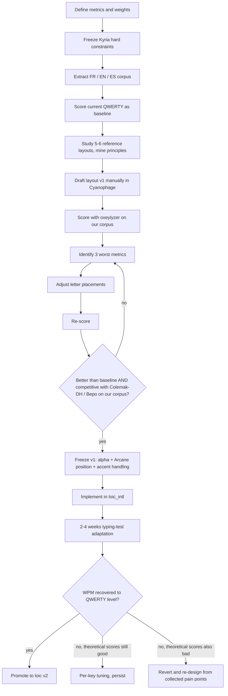

# Kyria — next iteration design (FR / EN / ES, Arcane-heavy)

> Design doc for the next keymap iteration. Current production reference: [kyria.md](kyria.md).
>
> Status: **design only**. No firmware change applied yet — the actual swap lives in section 3 ("Implementation sketch") and only ships after a measurement window on the current build.

## 1. Project goals

| Priority | Language | Why |
|---|---|---|
| 1 | **French** | Primary writing language (chats, notes, commit messages in FR projects). |
| 1 | **English** | Code, technical writing, most public commit messages. Tie-break with FR = whichever I'm typing right now. |
| 2 | **Spanish** | Conversational use (`ñ`, `¿`, `¡`, accented vowels). Should not cost ergonomics on FR/EN. |

**Core thesis** — custom layout designed from scratch, inspired by existing families (Colemak-DH, Bépo, Hands Down, Engram, Recurva, Graphite) but not derived from any single one. Heavy Arcane (Repeat / Alt-Repeat) is part of the design — it lets us accept a slightly higher SFB target than a pure SFB-minimizer would tolerate, and frees the alpha layout to optimize for rolls, alternation, and finger load.

**Constraint** — stay on the Kyria 50-key physical board until proven otherwise. Inner column gets re-evaluated after measurement (see §4).

## 2. Decision 1 — Swap Arcane ↔ `.`/`:`

### Direction

- **Arcane** moves to the thumb 3rd-from-outer positions (currently `SYR_DOT` / `SYL_COL` taps).
- **`.` and `:`** move to the innermost-bottom-row positions (currently `ARCANE_L` / `ARCANE_R` after the 2026-05 inner-row swap).
- **Hold layers stay**: left thumb still holds `_SYM_R`, right thumb still holds `_SYM_L`. Only the **tap** action of those thumb keys changes.
- **Tab stays** on the inner-but-not-innermost slots (array positions 6 / 9).

### Why

| Reason | Detail |
|---|---|
| Best roll slot | From any alpha letter the thumb is already idle. Firing Arcane on tap = zero finger reposition. This is the SFB-rescue flow we want to dominate. |
| Symmetry of intent | Left-half letters → left thumb Arcane = `repeat_key_invoke` (same-hand); right-half letters → left thumb Arcane = `alt_repeat_key_invoke` (cross-hand magic). Same on the right thumb. The half-of-thumb still dictates same vs cross. |
| `.` and `:` survive | `.` stays on alpha row (right-half col 4), in SYM_R, and gains the innermost-bottom-left slot. `:` lives in SYM_R + the innermost-bottom-right slot. "Sur le pouce" survives via SYM hold (`hold left thumb → SYM_R → .`). |
| One less LT() tap surprise | Currently `SYR_DOT` taps `.` mid-word if the hold timing is off. Replacing tap with Arcane means a stray tap fires Repeat instead — still wrong sometimes, but much less destructive than an unwanted `.`. |

### Costs

| Cost | Mitigation |
|---|---|
| Vim's `.` (repeat-last-change) needs hold-SYM_R + tap `.` → +~150 ms per use. | Measure with `keystats.py` before/after — if `.` count drops sharply, reconsider. Alpha-row `.` is still 1-key, just no longer on the prime thumb slot. |
| `:` for vim command-line is also hold-then-tap. | Vim users already have `;` mapped to `:` in many configs — verify nvim setup. SYM access is still single-hold. |
| Re-learning two thumb taps. | A week of muscle-memory adjustment. The hold direction (SYM layer) is unchanged so the dominant motion is the same. |

## 3. Implementation sketch (firmware-side, apply when validated)

Diff against the current `keymap.c`:

```c
// _ALPHA bot row (array positions 6-9)
// BEFORE: KC_TAB, ARCANE_L, ARCANE_R, KC_TAB
// AFTER:  KC_TAB, KC_DOT,   KC_COLN,  KC_TAB
```

```c
// Thumb aliases (top of keymap.c, near other LT defines)
// BEFORE:
//   #define SYR_DOT   LT(_SYM_R, KC_DOT)
//   #define SYL_COL   LT(_SYM_L, KC_SCLN)   // tap emits ':' via process_record_user
// AFTER:
//   #define SYR_ARC   LT(_SYM_R, KC_F24)    // F24 = placeholder; never emitted
//   #define SYL_ARC   LT(_SYM_L, KC_F23)    // F23 = placeholder
```

```c
// process_record_user additions (placed alongside the existing ARCANE_L / ARCANE_R cases)
case KC_F24:  // tap of SYR_ARC (left thumb)
    if (record->tap.count && record->event.pressed) {
        // exact same body as the current ARCANE_L case
        // (Space-then-Arcane → one-shot Shift; otherwise repeat / alt-repeat
        //  based on last_key_left_hand, with synthesized press+release)
        return false;
    }
    return false;  // block on hold so LT() never accidentally emits F24

case KC_F23:  // tap of SYL_ARC (right thumb) — mirror of above
    ...
```

Per-key tuning to copy from the old aliases:

| Function | Old key | New key | Action |
|---|---|---|---|
| `get_tapping_term` | `SYR_DOT`, `SYL_COL` | `SYR_ARC`, `SYL_ARC` | rename, same values |
| `get_flow_tap_term` | `SYR_DOT` = 0, `SYL_COL` = 0 | `SYR_ARC` = 0, `SYL_ARC` = 0 | rename, same values |
| `get_hold_on_other_key_press_per_key` | as today | as today | rename only |
| `caps_word_press_user` | `.` and `:` already excluded | nothing | no change |
| `key_overrides` | nothing involves these aliases | nothing | no change |

`PHYSICAL_LABELS` in `keystats.py` needs a pass to relabel positions once the swap lands (current labels still reflect the 2026-05 state).

## 4. Design framework (custom layout)

### 4.1 Methodology — design, don't pick

The next layout is **designed from scratch**, not selected from existing layouts. The deliverable is a layout **plus a defensible rationale per letter**, not "we tried Colemak-DH on our corpus and it was OK". Existing layouts are studied to **mine their principles** (vowel placement, roll direction, finger load distribution), never copied wholesale.

This framing changes the work: the bottleneck stops being "which layout?" and becomes "what are our priorities, and how do we score a draft against them?". The rest of this section formalizes that pipeline.

### 4.2 Metrics & weights

Weights below are **starting points to revisit** during the design phase. They encode our typing priorities — change them and the optimal layout changes.

| Metric | Definition | Proposed weight | Rationale |
|---|---|---|---|
| **SFB** (same-finger bigram) | Two consecutive letters on the same finger | High (negative) | Painful, but Arcane absorbs the top offenders — we can accept slightly higher SFB than a pure SFB-minimizer would tolerate. |
| **Lateral stretch** | Index/pinky reaching the inner column | High (negative) | Kyria-specific pain; the inner column has the longest finger travel. |
| **Scissors** | Adjacent fingers on non-adjacent rows | High (negative) | Awkward to roll, slows the hand. |
| **Roll inward** | Two-letter sequence toward the thumb on the same hand | Strong positive | The fastest motion on a split — maximize. |
| **Roll outward** | Two-letter sequence away from the thumb on the same hand | Medium positive | Slower than inward but still good. |
| **Alternation** | Consecutive letters on opposite hands | Positive | FR likes alternation (vowel-consonant structure). Helps recovery from a slow finger. |
| **Redirect** | Roll that flips direction mid-word | Negative | Disrupts flow more than a clean roll-then-alternate. |
| **Finger load** | Frequency distribution across fingers | Equalize toward pinky < ring < middle < index | Pinky overload is the #1 cause of long-session fatigue. |
| **Home row %** | Share of frequency on home row | Maximize | Less wrist travel, less reach. |

**How to use this table**: when scoring a draft, compute a weighted sum across metrics. When comparing two drafts, compare per-metric — the weighted total hides trade-offs that the per-metric view exposes.

### 4.3 Hard constraints from Kyria

Fixed BEFORE placing any letter — these are non-negotiable inputs to the design:

- **Home-row mods (CAGS order)** — 4 positions per hand are reserved for the mod-tap. The positions are fixed; the letters that land there are chosen, but they must form a coherent CAGS chord (typical pattern: pinky=Ctrl, ring=Alt, middle=Gui, index=Shift).
- **Enter combos** — 2 adjacent home-row pairs (current `D+F` and `J+K` equivalents). The letters chosen for these positions must form a comfortable simultaneous press — no scissors, both home-row.
- **Thumb cluster (5 keys per side)** — Space, NAV hold, SYM hold, NUM_ESC / Bksp, encoder-click. Pre-assigned, doesn't compete with alpha letters.
- **Arcane position** — open question to resolve **during** the design phase, not before. Candidates: innermost-bottom (current, post 2026-05 swap), thumb 3rd-from-outer (the swap discussed in §2-§3), asymmetric.
- **Inner-column bottom slots** — 2 premium slots per side (currently Tab + Arcane). Allocate consciously; they're as accessible as a home-row key.
- **Punctuation on alpha layer** — `.` `,` `/` `'` `\` must stay on the alpha layer. These 5 keys are hard-pinned for code typing comfort.
- **`;` on pinky-right home** — typical convention; verify against the final design but assume true.

### 4.4 Reference layouts to mine

Each row's "what we want to steal" column is the single insight worth porting — not the layout itself.

| Layout | Family | Core principle | What we want to steal | Link |
|---|---|---|---|---|
| **Colemak-DH** | Colemak + DH mod | Common letters on home, rolls inward, vowels split (E left, IOU right) | Roll-inward bias, home-row coverage strategy | [colemakmods.github.io/mod-dh](https://colemakmods.github.io/mod-dh/) |
| **Bépo** | French-optimized | Voyelles all-left, consonnes all-right → maximum alternation in FR | Vowel-cluster strategy when targeting alternation-heavy languages | [bepo.fr](https://bepo.fr/) |
| **Hands Down** | Reiser family (multiple variants) | Extreme focus on rolls, accepts higher SFB in exchange | How to weight rolls aggressively without breaking comfort | [sites.google.com/alanreiser.com/handsdown](https://sites.google.com/alanreiser.com/handsdown) |
| **APT** | Modern community | Low pinky load by relocating high-frequency letters off the weak fingers | Pinky-load minimization as an explicit metric | r/KeyboardLayouts wiki |
| **Engram** | Multi-language, GA-optimized | Genetic algorithm seeded with multiple languages → robust across corpora | Multi-language scoring methodology | [engram.dev](https://engram.dev/) |
| **Recurva** | Modern variant | Re-thought vowel placement based on bigram analysis | Modern bigram-driven vowel strategy | r/KeyboardLayouts |
| **Graphite** | Code-optimized | Symbol layer integration into the alpha scoring (symbols are not free) | Treating symbols as first-class scoring inputs | r/KeyboardLayouts |

### 4.5 Scoring tools

Each tool plays a different role in the iteration loop — none replaces the others.

| Tool | Type | Strength | When to use |
|---|---|---|---|
| **Cyanophage Designer** | Web, drag-and-drop | Instant visual scoring, multiple built-in metrics, comparison view | Initial drafting — try positions fast, get immediate feedback |
| **oxeylyzer** | Rust CLI | Scriptable, custom weights, side-by-side comparison of N layouts on a single corpus | Final scoring against OUR corpus with OUR weights — the source of truth |
| **keysolve.de** | Web | Quick sanity-check scoring on a paste-in corpus | Mid-iteration cross-check to confirm Cyanophage's numbers |
| **Genkey** | Go CLI | Simulated-annealing generator | Optional: feed it a partial layout + constraints to get machine-suggested seeds for stuck iterations |

**Iteration tool flow**: draft in Cyanophage (visual, fast) → export → score with oxeylyzer on our weighted corpus (authoritative) → analyse worst 3 metrics → manually adjust placements → re-score. If stuck for 2+ cycles, run Genkey to generate a fresh seed.

### 4.6 Iteration loop



### 4.7 Design deliverables

Produced BEFORE writing any firmware code:

1. **Weights file** — committed to dotfiles (`dotfiles/cheatsheets/kyria-weights.yaml` or similar). Formalizes the metric priorities from §4.2 so future-me can re-evaluate trade-offs without re-deriving them.
2. **`layout-v1.txt`** — final layout in [oxeylyzer-compatible format](https://github.com/o-x-e-y/oxeylyzer) (30 letters arranged 3 rows × 10 columns, plus special key assignments for thumbs, Arcane, inner-bottom slots).
3. **Scoring report** — markdown table comparing our layout vs QWERTY (baseline) vs Colemak-DH vs Bépo on each metric from §4.2, on our corpus from §5. Goal: be better than QWERTY everywhere, competitive with the two reference layouts overall.
4. **Rationale per letter** — markdown doc explaining why each letter is at its position. Critical for defending the layout when doubts hit at month 3. Format: one line per letter, citing the metric(s) that drove the placement.
5. **Arcane position decision** — final answer to "innermost-bottom vs thumb vs asymmetric", informed by the scoring (e.g., "thumb-Arcane scored worse on SFB-rescue coverage because the LT timing introduced noise" or similar).
6. **Accent handling decision** — final answer to "macOS dead-keys vs QMK Unicode vs accent layer", with the cross-OS compat matrix that drove it.

## 5. SFB / digram seed map

This table serves **two distinct purposes** in the design pipeline:

- **(a) Scoring input** — these high-frequency digrams are the ones our drafts must score well on under the metric weights from §4.2. A draft that bombs on `qu`, `tion`, or `ent` is rejected regardless of its global score.
- **(b) Alt-repeat seed** — once the alpha layout is frozen, this map is the starting point for the new keymap's `get_alt_repeat_key_keycode_user` (currently at [keymap.c:105](../../qmk_userspace/keyboards/splitkb/halcyon/kyria/keymaps/loic/keymap.c) in `loic/`).

Goal under (b): every entry below should be killable by **one Arcane tap** in the next layout.

### French — top digrams to absorb

| Digram | Approx. FR freq rank | Current QWERTY cost | Proposed alt-repeat trigger |
|---|---|---|---|
| `qu` | 1 (almost always together) | OK | `Q → U` (already wired) |
| `es` | top-3 (plural, verb) | OK | `E → S` |
| `de` | top-5 (preposition) | OK | `D → E` (already wired) |
| `re` | top-5 (prefix, verb) | OK | `R → E` (need to add) |
| `le` | top-5 | OK | `L → E` |
| `nt` | top-5 (verb endings) | SFB on index | `N → T` |
| `on` | top-10 | OK | `O → N` |
| `er` | top-10 (verb inf.) | OK | `E → R` (conflicts with `E → D`; pick by context or measure) |
| `ou` | top-10 | OK | `O → U` |
| `ai` | top-10 (imparfait, futur) | SFB-ish | `A → I` |
| `eu` | top-15 | OK | `E → U` (conflicts; see above) |
| `an` | top-15 | OK | `A → N` |
| `oi` | top-20 | OK | `O → I` (conflicts with `O → L`) |
| `tion` | suffix | needs 4-key combo | candidate for a dedicated combo or `T → I` chained |
| `ent` | suffix | SFB on index | candidate for combo `E+N+T` → `ent` |

> Conflicts where one source letter wants two different destinations (`E`, `O`) are the reason for moving Arcane to thumbs: a second Arcane access point on the same row lets us **disambiguate by hand**. Open question to revisit once thumbs hold Arcane.

### English — top SFBs

| Digram | Status |
|---|---|
| `un`, `nu` | wired (`U ↔ N`) |
| `my`, `ym` | wired (`M ↔ Y`) |
| `gh` | wired indirectly via `G → T` (covers `gh` poorly — needs review) |
| `rt`, `tr` | partial — `R → F` exists, `T → G` exists, `rt` not directly wired |
| `ce`, `ec` | not wired — candidate (`C → E` exists, `E → C` missing) |
| `de`, `ed` | wired (`D ↔ E`) |
| `ie`, `ei` | not wired — `I → K` collision |
| `ny` | wired (`Y → M` covers reverse) |

### Spanish — top digrams

| Digram | Notes |
|---|---|
| `ll` | same-letter — Arcane Repeat handles natively (`repeat_key_invoke`). |
| `rr` | same as `ll`. |
| `qu` | shared with FR, already wired. |
| `gu` (`gue`/`gui`) | wire `G → U`? collision with `G → T`. Defer. |
| `ció` / `ción` | composite — candidate for combo once accent strategy is decided. |

> Most ES bigrams collapse to repeats. Confirm with corpus once we have ES samples.

## 6. Migration plan

1. **Today (2026-05)** — this doc + discoverability pointers in [kyria.md](kyria.md), [index.md](index.md), [keymaps-hub.md](keymaps-hub.md). No firmware change.
2. **Days 1-14 — measurement window** — live on the current keymap (Arcane on innermost-bottom after the 2026-05 inner swap). Run `python3 keystats.py analyse` mid-week and end-of-week. Bug-fix only, no design change. The §2-§3 thumb-Arcane swap is **deferred** — to be re-evaluated as a candidate during the design phase, not applied unilaterally.
3. **Days 15-30 — Design phase** (the heart of the project):
   - Extract corpus (FR via `git log` on personal projects + Obsidian notes ; EN via technical writing + code commits ; ES via chat exports or public-domain text).
   - Establish metric weights (§4.2) — commit a `kyria-weights.yaml` (or similar) to dotfiles so the priorities are defendable.
   - Study the 5-6 reference layouts from §4.4 — note the principle to steal from each in a markdown scratchpad.
   - Draft v1 manually in Cyanophage Designer using the weights and constraints.
   - Score v1 with oxeylyzer on our corpus. Identify the 3 worst metrics.
   - Iterate (target 4-6 cycles minimum). Acceptance criteria: (a) better than QWERTY baseline on weighted score, (b) competitive overall with Colemak-DH and Bépo on our corpus, (c) no single metric catastrophically worse than the reference layouts.
   - Freeze v1: alpha layout + Arcane position + accent handling decision.
   - Produce the design deliverables from §4.7 (weights file, layout-v1.txt, scoring report, rationale per letter).
4. **Days 31+ — Implementation** — scaffold `keyboards/splitkb/halcyon/kyria/keymaps/loic_intl/` (copy of `loic`, swap the alpha block, port all custom logic — Arcane, OSM, Caps Word, NUM_ESC overrides, TFT display, encoders). Build in parallel with the current keymap. Update `PHYSICAL_LABELS` in `keystats.py` to match the new positions.
5. **Days 32-60 — Adaptation period** — typing tests on Monkeytype (FR / EN / ES word lists) + keybr.com per-letter drill. WPM will drop sharply at first and recover over 2-4 weeks. Capture stats continuously with `keystats.py`.
6. **Final decision** — keep `loic_intl` (promote to `loic_v2`, retire `loic`) / revert to `loic` if WPM recovery stalls below 80% of QWERTY baseline / re-design from collected pain points if multiple metrics regressed in practice vs theory.

## 7. Cross-links

### Project files

- Current production cheatsheet: [kyria.md](kyria.md)
- Firmware folder: `~/dev/perso/qmk_userspace/keyboards/splitkb/halcyon/kyria/keymaps/loic/`
- Stats / capture script: `keystats.py` in the keymap folder. `PHYSICAL_LABELS` will need a refresh after any swap above lands in firmware.
- Cheatsheet hub: [index.md](index.md) · [keymaps-hub.md](keymaps-hub.md)

### Scoring tools (for the design phase)

- [Cyanophage Designer](https://www.cyanophage.com/layouts) — drag-and-drop drafting with instant scoring
- [oxeylyzer (GitHub)](https://github.com/o-x-e-y/oxeylyzer) — Rust CLI, custom weights, side-by-side comparison
- [keysolve.de](https://keysolve.de) — quick sanity-check scoring
- [Genkey (GitHub)](https://github.com/semilin/genkey) — Go CLI, simulated-annealing generator

### Community & references

- [r/KeyboardLayouts](https://www.reddit.com/r/KeyboardLayouts/) — most active community, layout discussions, scoring debates
- [colemakmods.github.io/mod-dh](https://colemakmods.github.io/mod-dh/) — Colemak-DH reference (and starting point for many mod families)
- [bepo.fr](https://bepo.fr/) — Bépo (FR-optimized layout) reference
- [engram.dev](https://engram.dev/) — Engram, multi-language GA-optimized layout

### Corpus sources

- **FR frequencies**: Lexique3 (LIP6) — `http://lexique.org/` — French word/digram frequency database
- **EN frequencies**: Google Books N-grams — `https://books.google.com/ngrams/` — large-scale EN bigram/trigram data
- **ES frequencies**: RAE corpus (CORPES XXI) — `https://www.rae.es/banco-de-datos/corpes-xxi` — Real Academia Española reference corpus
