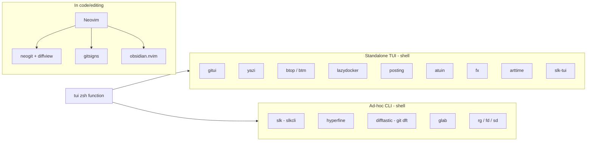

# TUI guide — what to launch when

> **Help:** `tui` (launcher) · then `?` inside the chosen TUI

> One-page decision matrix for every interactive terminal app in this setup. Each row links to a dedicated cheatsheet for keybindings.
> Launcher: type `tui` in any shell to fuzzy-pick a tool with live preview (see [`tui` function in zshrc](../conf/zsh/zshrc)).

## Decision matrix — by task

### Git workflow

| I want to... | Tool | How |
|--------------|------|-----|
| Stage hunks while editing a file | [gitsigns](../conf/nvim/lua/plugins/gitsigns.lua) | nvim, `<leader>hs` |
| Full staging / commit / rebase in nvim | [neogit](neogit.md) | nvim, `<leader>gg` |
| Browse commit range or file history | diffview (via neogit) | nvim, `<leader>gd` / `<leader>gD` |
| Git ops outside nvim (Cursor, plain shell) | [gitui](gitui.md) | shell, `gu` |
| Read a colored diff in `git diff` / `log` | [delta](delta.md) | automatic (configured pager) |
| AST-aware diff (refactor that moves blocks) | [difftastic](difftastic.md) | shell, `git dft HEAD~1` |
| Fuzzy-search commits / branches / files | fzf-lua git pickers | nvim, `<leader>gc/gb/gf` |
| Manage GitLab MRs / CI / issues | [glab](glab.md) | shell, `gp` / WezTerm `Cmd+Shift+;` → glab-pick |
| Run API + web + worker together | [mprocs](mprocs.md) | shell, `mp` / `mprocs` |

### Code search & refactor (CLI)

| I want to... | Tool | How |
|--------------|------|-----|
| Find text in repo | [ripgrep](ripgrep.md) | `rg pattern` |
| Find/refactor by syntax tree | [ast-grep](ast-grep.md) | `sg run -p '...' -l ts` |

### System & process inspection

| I want to... | Tool | How |
|--------------|------|-----|
| Full dashboard (CPU/RAM/net/disk/proc) | [btop](btop.md) | shell, `btop` |
| Lightweight monitor with charts | [bottom](bottom.md) | shell, `btm` |
| Process tree with colors | [procs](procs.md) | shell, `procs` |
| Disk usage (what's eating space) | [dust](dust.md) | shell, `dust` |
| Count lines of code | [tokei](tokei.md) | shell, `tokei` |
| See running Docker containers | [lazydocker](lazydocker.md) | shell, `lzd` |

### Files & navigation

| I want to... | Tool | How |
|--------------|------|-----|
| Browse files visually (previews) | [yazi](yazi.md) | shell, `y` |
| Sidebar tree (orientation) | neo-tree | nvim, `<leader>e` |
| Edit filesystem like a buffer (rename, create, move) | [oil.nvim](oil.md) | nvim, `-` or `<leader>O` |
| Find a file by name | [fd](fd.md) | shell, `fd pattern` |
| Find a file interactively | [fzf](fzf.md) | shell, `Ctrl+T` |
| Search text in files | [ripgrep](ripgrep.md) | shell, `rg pattern` |
| Jump to a recent directory | [zoxide](zoxide.md) | shell, `z partial-name` |
| View file with syntax | [bat](bat.md) | shell, `cat file` (aliased) |

### Comms (Slack)

| I want to... | Tool | How |
|--------------|------|-----|
| Chat in Slack from the terminal (Vim keys, multi-workspace) | [slk-tui](slk-tui.md) | shell, `slk-tui` or `tui` |
| Quick unread / read / send (scripts, agents) | [slkcli](slkcli.md) | shell, `slk unread` / `slk read` (macOS; uses Slack.app session) |

### Shell history & launch

| I want to... | Tool | How |
|--------------|------|-----|
| Search command history | [atuin](atuin.md) | shell, `Ctrl+R` |
| Inspect detailed command metadata | atuin | shell, `Ctrl+R` then `Ctrl+O` |
| Launch a TUI from a menu | tui (zsh function) | shell, `tui` |
| Recall man pages tldr-style | [tldr](tldr.md) | shell, `tldr cmd` |

### HTTP / API / data

| I want to... | Tool | How |
|--------------|------|-----|
| Send / save HTTP requests (collections) | [posting](posting.md) | shell, `posting` |
| Quick `curl` one-shot | curl (or xh if installed later) | shell |
| Explore a JSON payload interactively | [fx](fx.md) | shell, `cat file.json \| fx` |
| Query JSON one-shot (scriptable) | [jq](jq.md) | shell, `jq '.field'` |

### Performance & diff

| I want to... | Tool | How |
|--------------|------|-----|
| Benchmark a command | [hyperfine](hyperfine.md) | shell, `hyperfine 'cmd'` |
| Compare two implementations | hyperfine | shell, `hyperfine 'a' 'b' --warmup 3` |

### Notes, time, misc

| I want to... | Tool | How |
|--------------|------|-----|
| Take a note in vault | obsidian.nvim | nvim, `<leader>nd` (daily) / `<leader>nf` (find) / `<leader>nn` (new) |
| Markdown preview | [glow](glow.md) | shell, `glow file.md` |
| Pomodoro / ASCII clock | [arttime](arttime.md) | shell, `arttime -t 25m` |

### Editing

| I want to... | Tool | How |
|--------------|------|-----|
| Edit code | Neovim | shell, `v file` or `v` |
| Quick text edit (when nvim feels heavy) | Neovim | shell, `v file` (it's already fast) |
| Find & replace across files | [sd](sd.md) | shell, `fd -e ts \| xargs sd 'old' 'new'` |

## Where each TUI lives

Not everything goes in Neovim. The split is intentional:

**Rule of thumb** :

- Tu codes ? → nvim (+ neogit + gitsigns + diffview pour le git)
- Tu inspectes / observes / migres ? → TUI standalone (`gu`, `lzd`, `btop`…)
- Tu fais une op one-shot ? → CLI ad-hoc (`hyperfine`, `git dft`, `rg`…)
- Tu cherches lequel utiliser ? → `tui` dans ton shell

## See also

- [index.md](index.md) — full "I want to..." mapping (broader, includes non-TUI tools)
- [keyboard-navigation.md](keyboard-navigation.md) — terminal/Neovim keybinds
- [keymaps-hub.md](keymaps-hub.md) — cross-app key binding overview

## Links

- Cheatsheets repo: https://github.com/laublet/dotfiles/tree/master/cheatsheets
